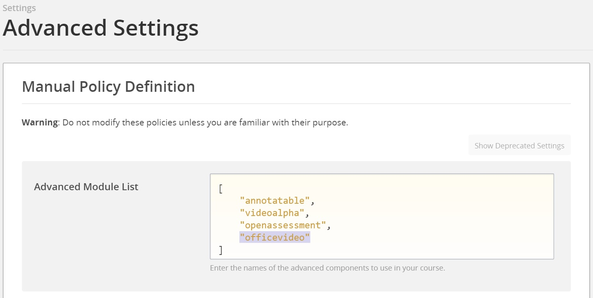
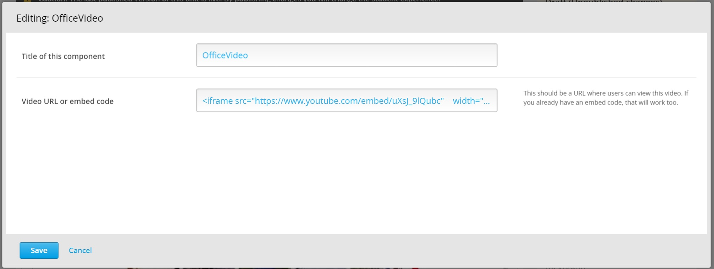
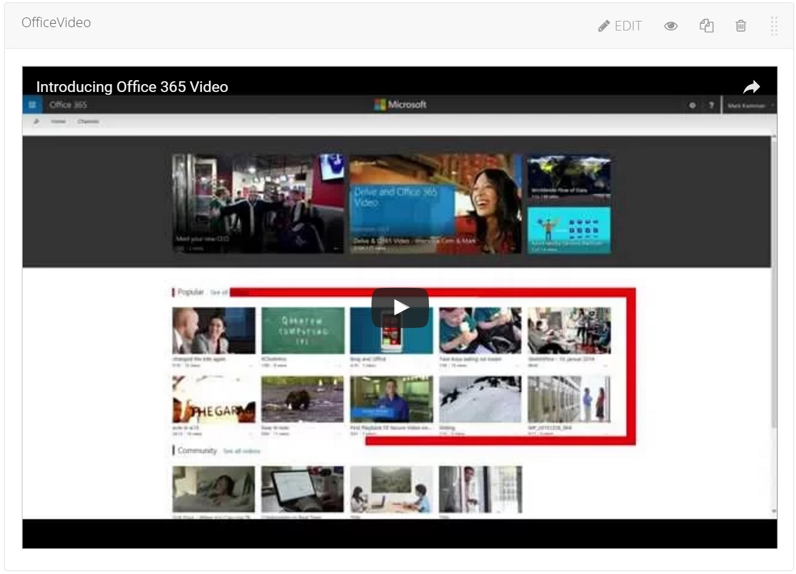

OfficeVideo XBlock
===================

The “OfficeVideo XBlock” allows course content authors to embed videos stored in Microsoft Office 365 Video to the course.

Students can view these videos in their Open edX or edX.org courses.

Code of Conduct
---------------
This project has adopted the [Microsoft Open Source Code of Conduct](https://opensource.microsoft.com/codeofconduct/). For more information see the [Code of Conduct FAQ](https://opensource.microsoft.com/codeofconduct/faq/) or contact [opencode@microsoft.com](mailto:opencode@microsoft.com) with any additional questions or comments.

Installation
------------

To install the OfficeVideo XBlock within your edX Python environment, run the following command:

```bash
$ pip install /path/to/xblock-officevideo/
```

Ensure that you have added the following to /edx/app/edxapp/edx-platform/cms/envs/common.py
- ALLOW_ALL_ADVANCED_COMPONENTS: True

Also ensure that you have restarted edX services after these steps.

Enabling in Studio
------------------

To enable the OfficeVideo XBlock within studio:

1. Navigate to `Settings -> Advanced Settings` from the top nav bar.
2. Add `"officevideo"` to the Advanced Module List, as shown in the screen shot below.



Usage
-----
Once enabled in Studio, it's easy to use the OfficeVideo XBlock.

Start by navigating to the unit in studio where you want to insert your video. From here choose the `Advanced` component.


This will bring up a list of the XBlocks that have been enabled in Studio. If you followed the previous step to enable the OfficeVideo XBlock in Studio you will see an option titled `Office Video`. Click on it to insert the Office Video XBlock into your unit.


After you've inserted the OfficeVideo XBlock, a default video will be inserted into your unit as shown in the screen shot below.


To change the video added to the course using the OfficeVideo XBlock, click on the `Edit` button on the upper-right corner of the XBlock. This will bring up the edit dialog where you can change the display name of the component as well as the video that is being inserted and how you want it to be embedded.



In this dialog, you can

- Update the XBlock title.
- Enter the URL or embed code for the video from its original location (in OfficeVideo) 
    - Note that the video must be accessible to the intended audience. 
    - Also, note that you do not need to obtain an embed code for the video yourself. The OfficeVideo XBlock can build it automatically at runtime from the URL for the video. (It will appear as just a link to the video in the Studio, but when students view it in the LMS after logging in using their Office 365 credentials, the link will be replaced by an embedded video.)

After you click save, your OfficeVideo XBlock will have been updated with the new values.

If you entered the embed code for the video:


If you had entered the URL to the video:


At this point simply click on the `Publish` button and the video will be available for students to view it from the LMS.


Troubleshooting
---------------

In case the XBlock fails to appear in the Advanced menu or other errors, you may check the following:
- Run `sudo -u edxapp /edx/bin/pip.edxapp list`, to verify that "xblock-officevideo" is installed
- Verify that "XBLOCK_SELECT_FUNCTION = prefer_xmodules" is present in the following config files:
  - /edx/app/edxapp/edx-platform/lms/envs/common.py
  - /edx/app/edxapp/edx-platform/cms/envs/common.py
- Ensure that you have restarted edX services after installing the XBlock
